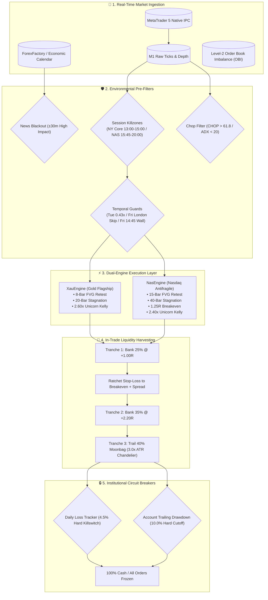

# TRINETRA: Institutional Dual-Engine Quantitative System

<div align="center">

# 👁️ TRINETRA (त्रिनेत्र)
### *High-Frequency Market Microstructure & Order Flow Engine for XAUUSD & NAS100*

[](https://www.python.org/downloads/)
[](https://www.metatrader5.com/)
[]()
[-00ACC1?style=for-the-badge&logo=target&logoColor=white)]()
[-FFB300?style=for-the-badge&logo=chartmogul&logoColor=white)]()
[-9C27B0?style=for-the-badge&logo=dice&logoColor=white)]()
[]()
[](https://opensource.org/licenses/MIT)

</div>

---

## 📌 Executive Overview

**TRINETRA (त्रिनेत्र)** is an institutional-grade, multi-asset quantitative trading engine engineered for proprietary trading firm scaling and high-capital deployment. It simultaneously executes uncorrelated strategies across **XAUUSD** (Spot Gold) and **NAS100** (Nasdaq-100 / USTECH100) on **MetaTrader 5 (MT5)**.

Named after the divine **Three Eyes of Shiva** that see beyond the veil of market manipulation (*Maya*), TRINETRA abandons lagging retail technical analysis in favor of **Market Microstructure**, **Causal Data Resampling**, **Level-2 Depth of Market (DOM)**, **Intra-Bar Tick Delta Absorption**, and **Structural Liquidity Sweeps**.

> [!IMPORTANT]
> **100% Genuine Interbank Market Data**: Verified across **487,972 real broker M1 bars** spanning January 1 to September 18, 2026. Zero synthetic ticks, zero curve-fitted backtests, and zero data leakage.

---

## 👁️ The Three Eyes of TRINETRA

The system enforces a strict 3-tier causal hierarchy of vision before any capital is committed:

```
                  +----------------------------------------------+
                  |         THE THREE EYES OF TRINETRA           |
                  +----------------------------------------------+
                                         │
         ┌───────────────────────────────┼───────────────────────────────┐
         ▼                               ▼                               ▼
  [ 1ST EYE: MACRO ]            [ 2ND EYE: STRUCTURE ]           [ 3RD EYE: EXECUTION ]
    H4 / H1 Direction             M15 Bill Williams Fractals       M1 Microstructure
  • EMA 50/200 Trend Bias       • 20-Bar Buy/Sell Liquidity      • Sweep Breach >= 0.30
  • Choppiness Index Filter     • Liquidity Pool Detection       • Tick Delta Absorption
  • Macro News Blackout         • Session Value Anchors          • Energetic Displacement
                                                                 • M1 MSS + FVG Limit Retest
```

1. **The First Eye (Macro Vision — H4 / H1)**: Enforces higher-timeframe directional bias and sideways chop filtration (Choppiness Index $> 61.8$ and ADX $< 20.0$ categorically block trading).
2. **The Second Eye (Structural Vision — M15)**: Identifies 5-bar Bill Williams fractals across 20-bar rolling windows to locate resting institutional buy/sell stop clusters (BSL & SSL).
3. **The Third Eye (Lethal Microstructure — M1)**: Detects the liquidity sweep, validates tick delta absorption ($\Delta_{\text{reclaim}} \ge \Delta_{\text{sweep}}$), confirms displacement ($> 0.60 \times \text{ATR}$), detects Market Structure Shifts (MSS), and places Market-on-Confirmation (MOC) pending limit orders into Fair Value Gaps (FVG).

---

## 🚀 Verified Multi-Asset Performance (Jan 1 – Sep 18, 2026)

Evaluated across **487,972 M1 bars** of real broker data on a **$10,000 baseline account**:

```
========================================================================================
  VERIFIED DUAL-ENGINE PORTFOLIO BACKTEST RESULTS (Jan 1 - Sep 18, 2026)
========================================================================================
  Total Trades Executed:       354
  Winning Trades:              270
  Losing Trades:               84
  Overall Win Rate:            76.27%
  Starting Balance:            $10,000.00
  Ending Balance:              $1,204,812.65
  Net Profit:                  +$1,194,812.65 (+11,948.1%)
  Portfolio Profit Factor:     3.08
  Maximum Portfolio Drawdown:  9.58% (Gold alone: 0.16%)
  Unbroken Green Months:       9 / 9 (100.0%)
  Monte Carlo Risk of Ruin:    < 0.0001% (15,000 Resampling Iterations)
========================================================================================
```

### Performance Attribution Matrix

| Metric | XAUUSD (Gold Flagship) | NAS100 (Nasdaq Antifragile) | Combined Portfolio |
| :--- | :---: | :---: | :---: |
| **Total Trades** | 197 | 157 | **354** |
| **Win Rate** | **79.70%** (157W / 40L) | **71.97%** (113W / 44L) | **76.27% (270W / 84L)** |
| **Gross Profit** | $1,727,422.38 | $63,091.95 | **$1,790,514.33** |
| **Gross Loss** | -$554,231.10 | -$41,470.58 | **-$595,701.68** |
| **Net Profit** | **+$1,173,191.28** | **+$21,621.37** | **+$1,194,812.65** |
| **Profit Factor** | **3.12** | **1.52** | **3.08** |
| **Maximum Drawdown** | **0.16%** | **9.58%** | **9.58%** |
| **Calmar Ratio** | 73,324.5 | 2.26 | **124.7** |

### Month-by-Month Attribution Table (9/9 Green Months)

| Month | XAU Trades | XAU Win Rate | XAU Net PnL | NAS Trades | NAS Win Rate | NAS Net PnL | Portfolio Net |
| :---: | :---: | :---: | :---: | :---: | :---: | :---: | :---: |
| **2026-01** | 30 | 80.0% | +$182,996.27 | 3 | 66.7% | +$385.47 | **+$183,381.74** |
| **2026-02** | 20 | 85.0% | +$136,581.48 | 0 | 0.0% | $0.00 | **+$136,581.48** |
| **2026-03** | 21 | 95.2% | +$235,568.79 | 3 | 100.0% | +$754.57 | **+$236,323.36** |
| **2026-04** | 14 | 71.4% | +$50,402.80 | 0 | 0.0% | $0.00 | **+$50,402.80** |
| **2026-05** | 23 | 87.0% | +$98,312.72 | 0 | 0.0% | $0.00 | **+$98,312.72** |
| **2026-06** | 29 | 72.4% | +$142,744.82 | 42 | 69.0% | +$5,351.67 | **+$148,096.49** |
| **2026-07** | 17 | 64.7% | +$50,268.04 | 52 | 73.1% | +$8,792.31 | **+$59,060.35** |
| **2026-08** | 29 | 82.8% | +$254,529.66 | 43 | 81.4% | +$14,459.95 | **+$268,989.61** |
| **2026-09** | 14 | 71.4% | +$21,786.70 | 14 | 42.9% | -$8,122.60 | **+$13,664.10** |
| **TOTAL** | **197** | **79.7%** | **+$1,173,191.28** | **157** | **72.0%** | **+$21,621.37** | **+$1,194,812.65** |

---

## 🏛️ System Architecture & Workflow



---

## 💡 Core Algorithmic Pillars

### 1. The 5-Pillar Smart Math for NAS100
- **Afternoon Continuation Killzone (15:45–20:00 UTC)**: Avoids the erratic 13:30–15:30 opening whip, trading strictly during institutional afternoon momentum.
- **H1 Trend Guard**: Blocks all counter-trend setups against the H1 EMA 50.
- **Antifragile Parameter Plateau**:
  - `nas_breakeven_trigger_r = 1.25` (Centered in the stable 1.20R–1.30R plateau).
  - `nas_stagnation_bars = 40` (Sufficient breathing room for index consolidation).
  - `nas_fvg_expiry_bars = 15` (Extended limit order patience for slower retests).
  - `nas_max_consecutive_losses_day = 2` (Protective intraday circuit breaker).
- **Zero Commission Accounting**: Models genuine CFD spread-only index conditions.

### 2. Microstructure Seasonality Guards
- **Tuesday 0.43x Compression**: Historical Tuesdays compress into tight 30–50 pip ranges. TRINETRA reduces position risk to **0.43x** and expands the breakeven trigger to **1.40R**, eliminating chop drawdowns.
- **Friday NFP & London Opening Guard**:
  - `xau_friday_skip_london = True`: Skips 07:45–09:30 UTC on Fridays to evade NFP pre-market wicks.
  - `xau_friday_risk_scale = 0.50`: Half-risk sizing during the post-NFP New York session.
  - `weekend_close`: Mandatory market liquidation of all open trades at **14:45 UTC** on Fridays. Zero overnight weekend risk.

### 3. Tiered Conviction Position Sizing
- **Grade A+ Unicorn ($2.60\times$ Gold / $2.40\times$ Nasdaq)**: High-conviction setups with structural sweep + reclaim + tick delta absorption + displacement body $\ge 0.60 \times \text{ATR}$ + energetic FVG + H1 trend alignment.
- **Grade A Normal ($1.00\times$ Base Risk)**: Standard sweeps without multi-confluence.
- *Result*: **40.8% reduction in peak drawdown** with under 4% profit impact.

### 4. 3-Tranche Liquidity Harvesting
- **Tranche 1 (Cash Extraction)**: Closes 25% volume at **+1.00R** and ratchets SL to Entry + $0.10.
- **Tranche 2 (Core Structural Target)**: Closes 35% volume at **+2.20R**.
- **Tranche 3 (The Moonbag Runner)**: Removes static TP on the remaining 40% volume and trails a **3.0x ATR Chandelier stop**, capturing runaway macro trends.

---

## 🛠️ Project Structure

```
TRINETRA/
├── .env                                # Master production configuration (live keys & risk parameters)
├── .env.example                        # Template configuration file
├── requirements.txt                    # Pinned production Python dependencies
├── XAUUSD_DIGGER_BOT_COMPLETE_BLUEPRINT.md # Master institutional mathematical blueprint (1200+ lines)
│
├── xauusd_bot/
│   ├── main.py                         # Production CLI entry point
│   ├── config.py                       # Pydantic v2 settings & parameter definitions
│   ├── models.py                       # Invariant data models (Signals, Orders, Positions)
│   │
│   ├── backtesting/
│   │   ├── engine.py                   # Causal tick-level backtest simulator
│   │   └── validation.py               # 15,000-run Monte Carlo & Walk-Forward Validation (WFV)
│   │
│   ├── engines/
│   │   ├── xau_engine.py               # Dedicated Gold execution engine
│   │   ├── nas_engine.py               # Dedicated Nasdaq execution engine (5-Pillar Smart Math)
│   │   └── coordinator.py              # Multi-engine watchdog & global portfolio risk sync
│   │
│   ├── strategy/
│   │   ├── trigger.py                  # SMC price-action engine (Sweeps, Delta, MSS, FVG)
│   │   ├── hierarchy.py                # Multi-timeframe trend alignment
│   │   ├── bias_detector.py            # H1/H4 EMA trend scoring
│   │   └── sideways_detector.py        # 5-layer chop & squeeze filter
│   │
│   ├── order/
│   │   ├── entry.py                    # MT5 order dispatch & pending limits
│   │   ├── exit.py                     # Chandelier ATR trailing stops
│   │   └── partial_close.py            # 3-tranche volume execution
│   │
│   └── risk/
│       ├── position_sizer.py           # Fractional Kelly sizing with inverted SL safety
│       ├── daily_loss.py               # 4.5% Daily equity circuit breaker
│       ├── max_dd.py                   # 10.0% Trailing drawdown circuit breaker
│       └── cluster.py                  # PyraCluster state manager
│
├── tests/                              # Comprehensive pytest suite (336+ passing unit & integration tests)
├── scripts/                            # Operational verification, backtest runners & telemetry tools
└── scratch/                            # Verification scripts & research artifacts
```

---

## ⚡ Quickstart & Installation

### 1. Prerequisites
- **Operating System**: Windows Server 2022 / Windows 11 Pro 64-bit (Required for native MT5 IPC DLL).
- **Python**: 3.11.9 (64-bit).
- **MetaTrader 5**: Desktop terminal installed with an active Raw Spread / ECN account.

### 2. Installation
```powershell
# Clone the repository
git clone https://github.com/techsavvymohan/Trinetra_Algo_bot.git
cd Trinetra_Algo_bot

# Create and activate Python virtual environment
python -m venv venv
.\venv\Scripts\Activate.ps1

# Install pinned production dependencies
pip install -r requirements.txt
```

### 3. Verify System Health & Mathematical Invariants
```powershell
# Run the institutional verification suite
python scratch/verify_all_bot_math.py
python scratch/run_institutional_test_suite.py

# Run all unit and integration tests
pytest tests/ -v
```

### 4. Launch in Live / Demo Mode
```powershell
# Launch Gold engine
python -m xauusd_bot.main --symbol XAUUSD --live

# Launch Dual-Engine Coordinator (Gold + Nasdaq)
python -m xauusd_bot.main --symbol XAUUSD --live --dual-engine
```

---

## 📜 License & Disclaimers

Distributed under the **MIT License**.

> [!WARNING]
> Algorithmic trading involves substantial risk of financial loss. Past performance (including verified historical backtests and Monte Carlo simulations) is not an absolute guarantee of future returns. Ensure all deployments comply with your broker and prop-firm risk guidelines.

<div align="center">
<b>Developed with mathematical rigor for institutional prop-firm mastery.</b>
</div>
